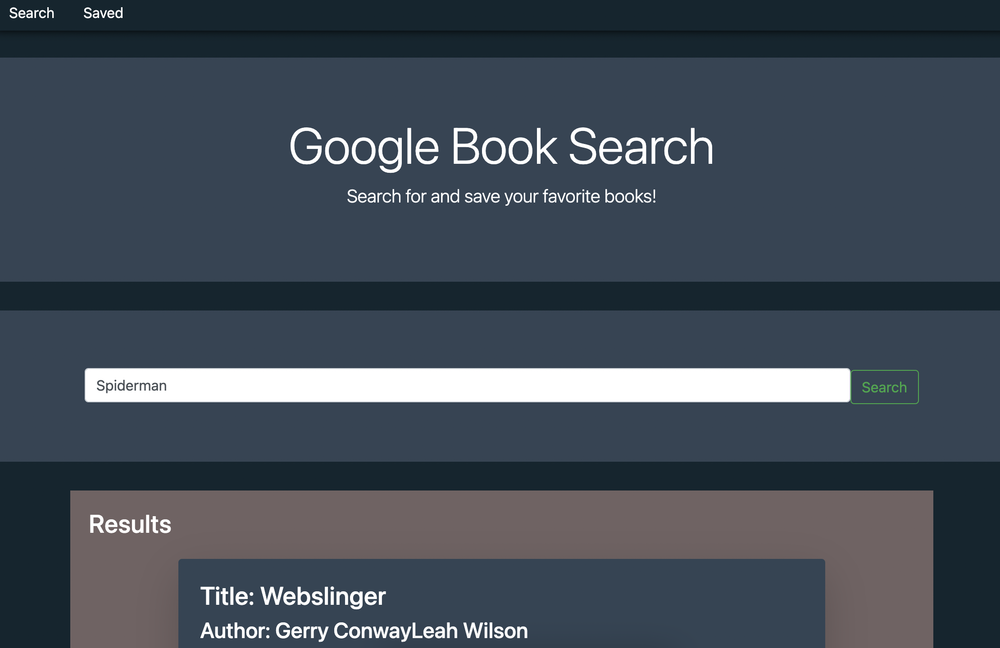
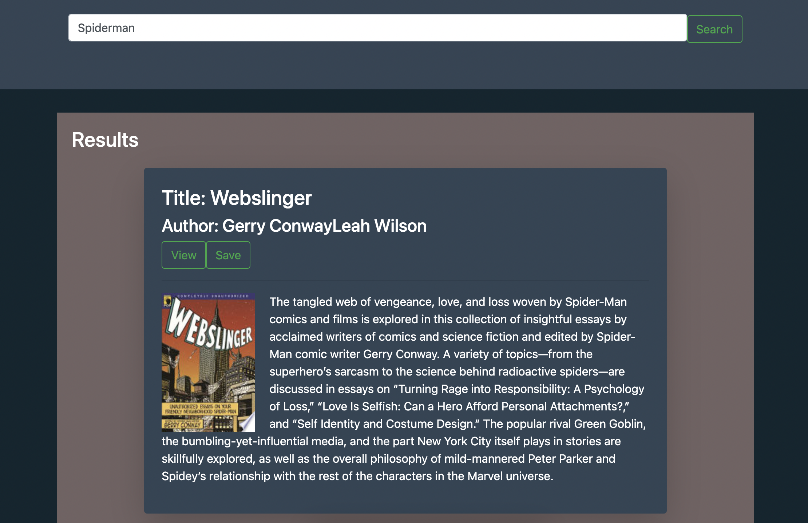

# Google Books Search Engine
  
  
  ## Descriptions

  This app allows users to search for any book of their choice and a list of books related to their search will appear. The search result will include a synopsis of the book, an image, title, author and buttons to save a book or purchase the book by redirecting the user to another page. The application also includes a saved books section where the user can view all the books previously saved. The user may also remove books from this list and it will update in real time without refreshing the page.

  ## Table of Contents

  * [Installation](#installation)
  * [Usage](#usage)
  * [License](#license)
  * [Credits](#contributing)
  * [Tests](#tests)
  * [Questions](#questions)
    
  ## Installation
  
  The user must install axios, express, mongoose, bootstrap, react, react-dom, react-router-dom, and react-scripts.
  
  ## Usage

  
  
  

  ## License

  This application is covered by the Creative Commons license.

  ## Contributing

  None.

  ## Tests

  No tests.

  ## Questions

  If you have any questions please send an email to: ldelgadothethird@gmail.com or go to github at: https://github.com/ldelgadoIII

